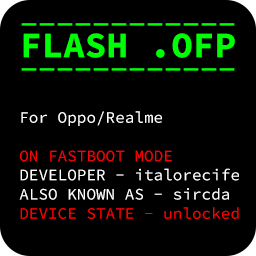

# Oppo/Realme Flash .OFP File on Bootloader


A tool to flash .ofp files in bootloader mode without needing MSM Tool, an alternative to official realme tool.

THE DEVICE MUST HAVE THE BOOTLOADER UNLOCKED
```
Not guaranteed to work on realme ui versions lower than 3.0
```
## Features
- soft unbrick
- install stock firmware
- switch device region

## Credits
- italorecife
- bkerler [oppo_decrypt](https://github.com/bkerler/oppo_decrypt)
- All contributors

## Installation

### Compiled version: [DOWNLOAD](https://github.com/italorecife/OppoRealme-OFP-Flash/releases/)
### OR
### Python version:

## Install

### Linux (in the example below I will use ubuntu)

#### Install adb & fastboot and simg2img
```
sudo apt-get install android-tools-adb android-tools-fastboot simg2img
```

#### Install python >=3.8, git and other deps

```
sudo apt install python3 git python3-pip
```

#### Grab files 
```
git clone https://github.com/italorecife/OppoRealme-OFP-Flash
cd OppoRealme-OFP-Flash
pip3 install -r requirements.txt
```

---------------------------------------------------------------------------------------------------------------

### Windows

Install the adb & fastboot drivers.

#### Install python + git
- Install python 3.9 and git
- WIN+R ```cmd```

#### Grab files and install
```
git clone https://github.com/italorecife/OppoRealme-OFP-Flash
cd OppoRealme-OFP-Flash
pip3 install -r requirements.txt
```

---------------------------------------------------------------------------------------------------------------

## Usage
Put the .ofp file in the same folder as the program, then put your device in mode fastboot to start flash.

Run:
```
python3 flash.py
```
if you have windows OS you can run normally by double clicking, and you have linux use terminal.

#[Detailed Usage Guide](https://telegra.ph/UnbrickFlash-StockChange-Region-02-06)
